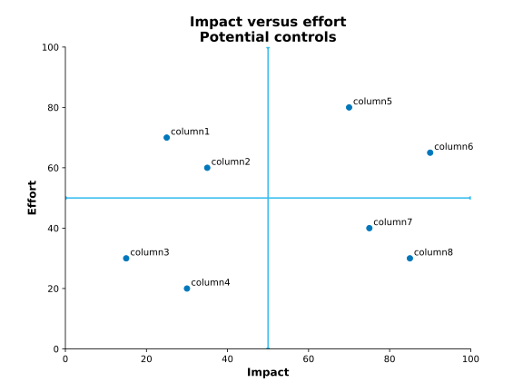

# Impact versus effort plot

## In brevi

It is a grid or matrix to help in deciding which things to work on. It focuses on the impact of doing something versus the effort required.

## Data

The data are built into the .py file.

## Methodology

An impact versus effort grid is drawn using a scatter plot with pandas.DataFrame.plot.scatter. Points are annotated with matplotlib.axes.Axes.annotate. The 'grid' is created with matplotlib.axes.Axes.axvline and matplotlib.axes.Axes.avhline.

## References

Health Quality Ontario. "Impact/Effort Decision Making Grid." [(http://www.hqontario.ca/Portals/0/documents/qi/learningcommunity/pc-impact-effort-decision-making-criteria-chronic-disease-roadmap-resource-en.pdf)](http://www.hqontario.ca/Portals/0/documents/qi/learningcommunity/pc-impact-effort-decision-making-criteria-chronic-disease-roadmap-resource-en.pdf). Accessed 2017-08-08.
